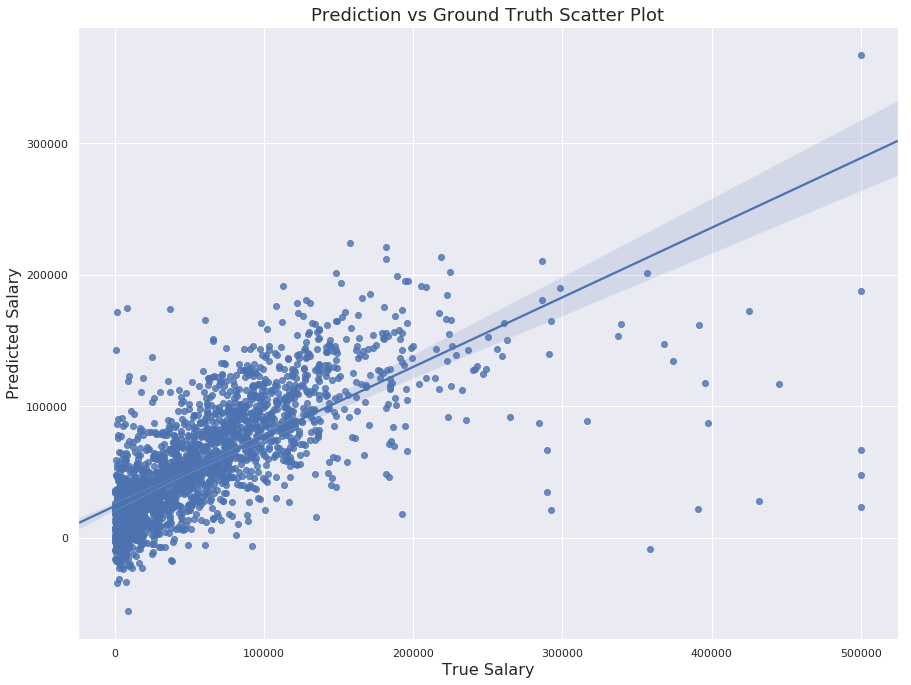

# README

- **airline_sentiment_prediction:** includes a sentiment analysis on US airline's customer opinions through applying natural language processing (NLP) techniques. The goal is to understand
- **salary_prediction:** includes a regression analysis on the salary of data scientists. Based on [2018 Kaggle Survey Challenge: Sallary Prediction](https://www.kaggle.com/kaggle/kaggle-survey-2018)

## Software Package Requirements

- Jupyter Notebooks (Can be imported into google colab as an alternative)
- Python 3.X
- **airline_sentiment_prediction**
  - pandas
  - numpy
  - html.parser
  - nltk
  - bs4
  - matplotlib
  - re
  - unicodedata
  - sklearn
- **salary_prediction**
  - pandas
  - numpy
  - missingno
  - matplotlib
  - re
  - seaborn
  - sklearn
  - category_encoders

## Prediction of Public Opinion on US Airlines

Prediction Accuracy Score: **80.9%**

|              | precision | recall | f1-score |   support   |   |   |
|:------------:|:---------:|:------:|:--------:|:-----------:|:-:|:-:|
|   negative   |    0.96   |  0.80  |   0.87   |     9178    |   |   |
|   positive   |    0.52   |  0.86  |   0.65   |     2362    |   |   |
|   micro avg  |    0.81   |  0.81  |   0.81   |    11540    |   |   |
|   macro avg  |    0.74   |  0.83  |   0.76   |    11540    |   |   |
| weighted avg |    0.87   |  0.81  |   0.82   | 11540</pre> |   |   |

## Prediction of Sentiment Reason

Prediction Accuracy Score: **65.0%**

|                         | precision | recall | f1-score | support    |
|-------------------------|:---------:|--------|----------|------------|
| Bad Flight              |    0.61   | 0.28   | 0.39     | 184        |
| Can't Tell              |    0.52   | 0.42   | 0.47     | 361        |
| Cancelled Flight        |    0.75   | 0.72   | 0.73     | 237        |
| Customer Service Issue  |    0.63   | 0.83   | 0.72     | 1085       |
| Flight Booking Problems |    0.65   | 0.25   | 0.37     | 177        |
| Late Flight             |    0.69   | 0.68   | 0.69     | 491        |
| Luggage Issue           |    0.75   | 0.63   | 0.68     | 219        |
| micro avg               |    0.65   | 0.65   | 0.65     | 2754       |
| macro avg               |    0.66   | 0.54   | 0.58     | 2754       |
| weighted avg            |    0.65   | 0.65   | 0.63     | 2754</pre> |

## Salary Prediction

**Model Result:**

- Mean Absolute Error: 25020.27
- Explained Variance: 0.52
- R2 Score: 0.51

