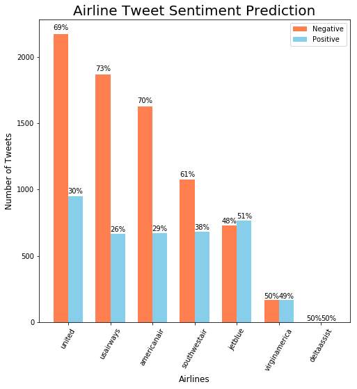

# US Airline Sentiment Analysis

- [Assignment1_Fall_2018.pdf](Assignment1_Fall_2018.pdf) contains the instructions
- [us_airline_sentiment.ipynb](us_airline_sentiment.ipynb) contains the analysis code
- [US_airline_tweets.csv](US_airline_tweets.csv) and [generic_tweets.txt](generic_tweets.txt) are the original data files

## Prediction of Public Opinion on US Airlines

Prediction Accuracy Score: **80.9%**
|              | precision | recall | f1-score |   support   |   |   |
|:------------:|:---------:|:------:|:--------:|:-----------:|:-:|:-:|
|   negative   |    0.96   |  0.80  |   0.87   |     9178    |   |   |
|   positive   |    0.52   |  0.86  |   0.65   |     2362    |   |   |
|   micro avg  |    0.81   |  0.81  |   0.81   |    11540    |   |   |
|   macro avg  |    0.74   |  0.83  |   0.76   |    11540    |   |   |
| weighted avg |    0.87   |  0.81  |   0.82   | 11540</pre> |   |   |

## Prediction of Sentiment Reason

Prediction Accuracy Score: **65.0%**
|                         | precision | recall | f1-score | support    |
|-------------------------|:---------:|--------|----------|------------|
| Bad Flight              |    0.61   | 0.28   | 0.39     | 184        |
| Can't Tell              |    0.52   | 0.42   | 0.47     | 361        |
| Cancelled Flight        |    0.75   | 0.72   | 0.73     | 237        |
| Customer Service Issue  |    0.63   | 0.83   | 0.72     | 1085       |
| Flight Booking Problems |    0.65   | 0.25   | 0.37     | 177        |
| Late Flight             |    0.69   | 0.68   | 0.69     | 491        |
| Luggage Issue           |    0.75   | 0.63   | 0.68     | 219        |
| micro avg               |    0.65   | 0.65   | 0.65     | 2754       |
| macro avg               |    0.66   | 0.54   | 0.58     | 2754       |
| weighted avg            |    0.65   | 0.65   | 0.63     | 2754</pre> |

