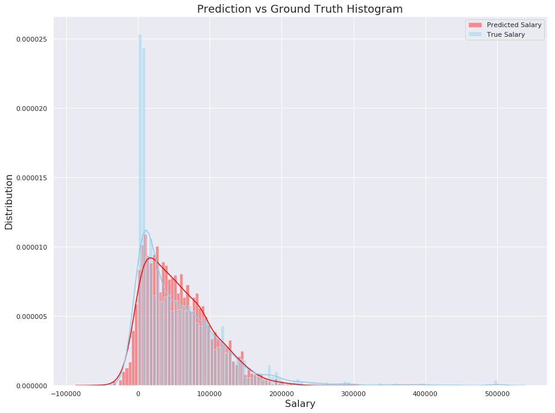
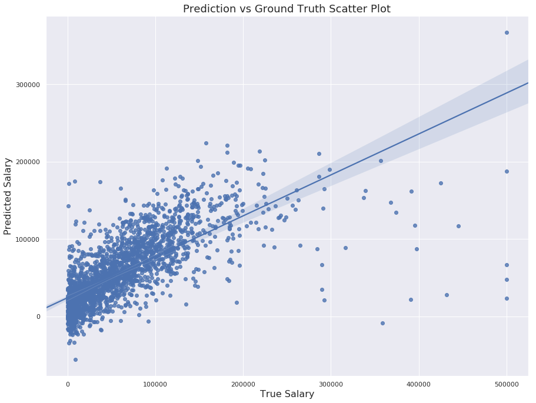

# 2018 Kaggle Survey Challenge: Salary Prediction

- [Assignment2_Fall_2018.pdf](Assignment2_Fall_2018.pdf) contains the instructions
- [salary_prediction.ipynb](salary_prediction.ipynb) contains the analysis code
- [Kaggle_Salary.csv](Kaggle_Salary.csv) is the original data file
- [salary_prediction.pdf](salary_prediction.pdf) contains the analysis summary
- [skip_kernel_extension.py](skip_kernel_extension.py) is a magic function that skips long running processes when `marking` parameter in [salary_prediction.ipynb](salary_prediction.ipynb) is set to true.

## Salary Prediction

**Model Result:**

- Mean Absolute Error: 25020.27
- Explained Variance: 0.52
- R2 Score: 0.51
